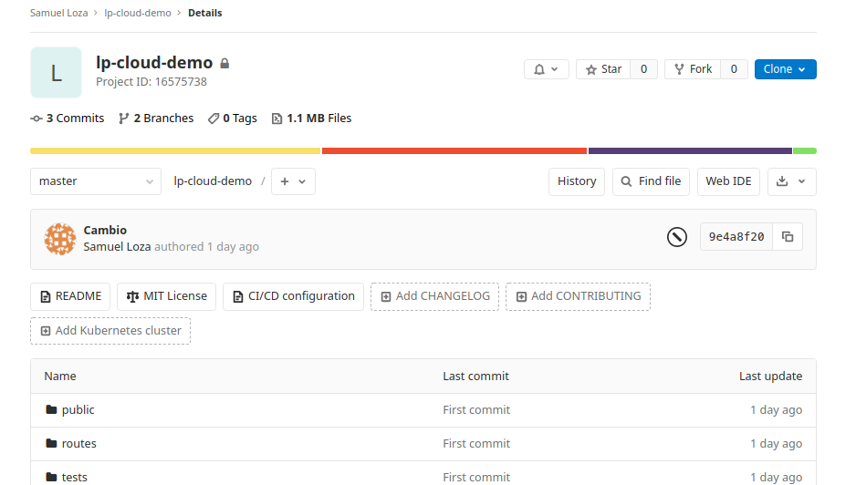
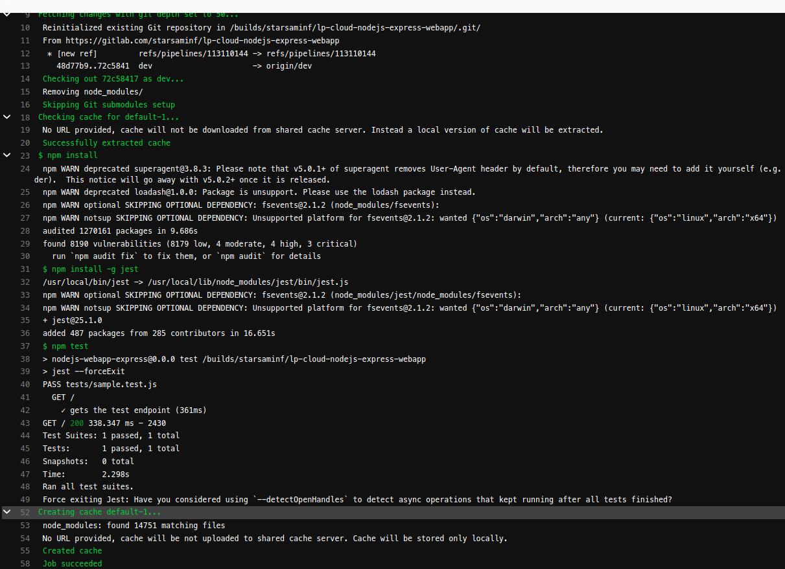
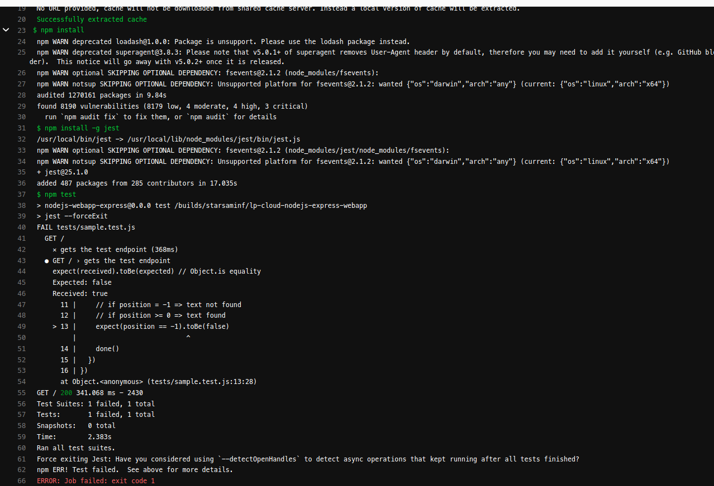

# ¿Qué es DevOps?

"DevOps es la union de personas, procesos y productos para lograr la entrega de valor continuo para los usuarios finales" Donovan Brown - Principal DevOps Manager Microsoft

# ¿Qué es Integración Contínua (CI)?

La Integración Continua (Continuous Integration CI) es una práctica que incrementa la eficacia y la eficiencia de los resultados del equipo de desarrolladores.

Consiste en combinar los cambios realizados en el código del proyecto, en un repositorio central de forma periódica, para luego ejecutar pruebas y detectar y reparar errores lo antes posible.
### Integración y entrega continuas (CI/CD)

La integración continua es una práctica de desarrollo de software en la que los desarrolladores fusionan mediante combinación los cambios de código en la rama de código principal con frecuencia. En la integración continua se utilizan pruebas automáticas, que se ejecutan cada vez que se hace “commit” de código nuevo. De este modo, el código de la rama principal siempre es estable.


# Objetivo
AL finalizar esta guia podras tener tus propio gitlab configurado para que cada vez que se haga un commit de codigo nuevo en la rama *dev* se ejecuten pruebas automaticas.

Revisa estos links si tienes dudas:
[Curso Udemy DevOps - Las Artes Marciales del Software ](https://www.udemy.com/course/devops-las-artes-marciales-del-software/)
[¿Qué es DevOps? Microsoft Azure](https://azure.microsoft.com/es-es/overview/what-is-devops/)

# Manos a la obra
+ Cuenta en gitlab.com (Con ella podrás ejecutar Gitlab CI hasta 2000 minutos al mes.)
+ [Proyecto](./integracion-continua-laboratorio/ejemplo-ci.zip)
+ Configuracion
 * Archivo .gitlab-ci.yml
+ Ejecutando las pruebas en Gitlab CI

## Configuración
Para hacer que **Gitlab CI** reconozca nuestras pruebas y las ejecute debemos configurar nuestro proyecto agregando un archivo **.gitlab-ci.yml**:

## Archivo .gitlab-ci.yml

**.gitlab-ci.yml** es un archivo de configuración **YAML** que debes crear en la raíz de tu proyecto, con el siguiente contenido.

```yaml
image: node:13.7.0
stages:
    - test-dev

cache:
    paths:
        - node_modules

before_script:
  - npm install
  - npm install -g jest

test-dev:
    stage: test-dev
    script:
        - npm test
```

Analicemos un poco este archivo:

**image: node:13.7.0** le indicamos cuál imagen de Docker usará Gitlab para ejecutar las pruebas.

**stages** es la secuencia de pasos en los que se ejecutaran los jobs (tareas).

**cache** podemos establecer cuales archivos y carpetas serán guardarán en cache.

**before_script** definimos el conjunto de comandos que se ejecutarán antes de que las pruebas sean ejecutadas. Para nuestro proyecto de **nodejs** necesitamos instalar las dependencias de la aplicación y realizar las configuraciones necesarias para que la app funcione correctamente.

**test-dev** es el job o trabajo que se va a ejecutar en **Gitlab Runner** y los comandos están definidos en **script**.

[Documentacion Yaml](https://docs.gitlab.com/ce/ci/yaml/README.html)

# Archivo de pruebas
Las prubas se encuentran dentro el archivo  test/sample.test.js
```javascript
const app = require('../app.js')
const supertest = require('supertest')
const request = supertest(app)

describe('GET /', () => {
  it('gets the test endpoint', async done => {
    const response = await request.get('/');
    expect(response.status).toBe(200)
    //Search especific text in the response
    const position = response.text.search("Node.js Express Application");
    // if position = -1 => text not found
    // if position >= 0 => text found
    expect(position == -1).toBe(false)
    done()
  })
})
```
Este test es simple, busca la cadena

```
Node.js Express Application
```
# Ejecutando las pruebas en Gitlab CI

Ahora procede a hacer commit de los dos archivos y git push para subir los cambios al repositorio.


Puedes ver estado del pipeline desde la opción CI/CD -> Pipelines, veras algo como:
*Un pipeline es un flujo de trabajo


Si todo salio bien, veremos algo similar:


En caso de fallo, veremos algo similar:



Desarrollar usando integración continua en nuestros proyectos es realmente beneficioso pues no necesitarías dedicarle mucho tiempo a probar el código cada vez que integras una nueva funcionalidad. Es bastante útil cuando se trabaja en equipos de desarrollo donde sus integrantes pueden no estar al tanto de todos los cambios y características del proyecto.